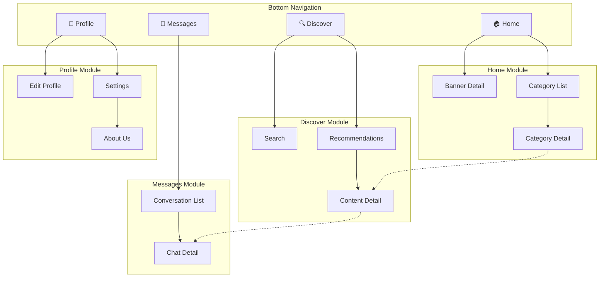

# Phase 2: Information Architecture

## Objective

Map out the complete page structure of the product. This is the equivalent of Modao's "page tree" feature.

## Deliverables

1. Page inventory table
2. Sitemap (Mermaid diagram)
3. Navigation structure
4. Global component list

---

## 1. Page Inventory Table

List every page/screen in the product. Use this table format:

[English]
```markdown
| ID | Page Name | Module | Level | Platform | Page Type | Entry Source | Description |
|----|-----------|--------|-------|----------|-----------|--------------|-------------|
| P01 | Home | Core | L1 | Mobile | Hub | App launch / Bottom Tab | Home feed and quick entries |
| P02 | Search | Search | L2 | Mobile | Search | Home search bar | Search input + results |
| P03 | Detail | Content | L3 | Mobile | Detail | List item tap | Content detail and actions |
```

**Platform values**: `Mobile` · `Desktop` · `MiniApp` · `Web` · `Cross-platform`
- Use `Cross-platform` when the page appears on multiple platforms with the same content/interaction (e.g. a settings page shared across mobile and desktop).
- Use separate rows when the same feature has significantly different layouts per platform.

[中文]
```markdown
| 编号 | 页面名称 | 所属模块 | 层级 | 平台类型 | 页面类型 | 入口来源 | 简要说明 |
|------|---------|---------|------|---------|---------|---------|---------|
| P01 | 首页 | 核心 | L1 | 移动端 | 聚合页 | App启动/底部Tab | 首页信息流和快捷入口 |
| P02 | 搜索页 | 搜索 | L2 | 移动端 | 搜索页 | 首页搜索栏 | 搜索输入+结果展示 |
| P03 | 详情页 | 内容 | L3 | 移动端 | 详情页 | 列表项点击 | 内容详情和操作区 |
```

**平台类型取值**：`移动端` · `PC端` · `小程序` · `Web` · `跨平台`
- 若同一页面在多端布局/交互高度一致，用 `跨平台`；若差异显著，拆分为独立行分别标注。

### Page Type Reference

**Core Content Types (1-5)**

| ID | Type | Chinese | Characteristics | Examples |
|----|------|---------|-----------------|----------|
| 1 | Hub | 聚合页 | Multi-module entry collection | Home, Dashboard |
| 2 | List | 列表页 | Collection display of similar content | Message list, Order list |
| 3 | Detail | 详情页 | Complete display of single content | Product detail, User profile |
| 4 | Search | 搜索页 | Search input + results | Global search |
| 5 | Filter | 筛选/排序页 | Condition combination to narrow results | Product filter, Advanced search |

**Form & Input Types (6-8)**

| ID | Type | Chinese | Characteristics | Examples |
|----|------|---------|-----------------|----------|
| 6 | Form | 表单页 | User input/edit information | Registration, Edit profile, Publish |
| 7 | Wizard | 多步表单 | Step-by-step guidance for complex input | Account opening flow, Publish wizard |
| 8 | Picker | 选择器页 | Select from preset options | City picker, Tag selection |

**Feedback & Result Types (9-10)**

| ID | Type | Chinese | Characteristics | Examples |
|----|------|---------|-----------------|----------|
| 9 | Result | 结果页 | Operation result feedback | Payment success, Submit success |
| 10 | Empty | 空态页 | Placeholder when no content | (Usually a state, not a standalone page) |

**Account & System Types (11-14)**

| ID | Type | Chinese | Characteristics | Examples |
|----|------|---------|-----------------|----------|
| 11 | Auth | 登录/注册页 | Authentication entry | Login, Register, Forgot password |
| 12 | Profile | 个人中心 | User personal info and feature entries | My page, Account center |
| 13 | Settings | 设置页 | Configuration item list | System settings, Account settings |
| 14 | About | 关于/协议页 | Product info and legal text | About us, User agreement, Privacy policy |

**Onboarding & Transition Types (15-17)**

| ID | Type | Chinese. | Characteristics | Examples |
|----|------|----------|-----------------|----------|
| 15 | Splash | 启动页 | Brand display at app launch | Launch screen, Splash page |
| 16 | Onboarding | 引导页 |  Feature intro for first-time users | New user guide, Feature carousel |
| 17 | Transition | 过渡/加载页 |  Feedback during waiting | Loading, Processing |

**Overlay Types (18)**

| ID | Type | Chinese | Characteristics | Examples |
|----|------|---------|-----------------|----------|
| 18 | Overlay | 弹窗/浮层 | Temporary layer above page | Confirm dialog, Bottom sheet, Popover menu |

**Desktop-Exclusive Types (19-22)**

| ID | Type | Chinese | Characteristics | Examples |
|----|------|---------|-----------------|----------|
| 19 | Workspace | 主窗口/工作区 |  Desktop core operation area | Editor main interface, IDE workspace |
| 20 | Side Panel | 侧边面板 | Expandable/collapsible auxiliary panel | File tree, Properties panel |
| 21 | Preferences | 偏好设置窗口 |  Desktop standalone settings window | App preferences |
| 22 | Tray/Menu Bar | 托盘/菜单栏 | System tray or menu bar entry | Status icon, Quick menu |

### Level Convention

- **L1**: Tab-direct(Tab 直达页) pages (shown in bottom navigation)
- **L2**: First-level(一级子页) subpages (entered from L1)
- **L3**: Second-level(二级子页) subpages (entered from L2)
- **L4**: Third-level(三级子页) subpages (avoid if possible; >4 levels indicates architecture needs optimization)

### Page Exhaustiveness Check

After designing the page inventory, verify against these dimensions for missing pages:

| Check Dimension | Items |
|-----------------|-------|
| User Lifecycle | Registration, Login, Onboarding, Daily use, Account deletion/dormancy |
| Content Lifecycle | Create, Edit, Review, Publish, Archive, Delete |
| Transaction Lifecycle | Browse, Order, Pay, Fulfill, After-sales, Review |
| Account Management | Profile, Security settings, Binding management, Verification |
| Notifications | Notification list, Notification detail, Notification settings, Push landing page |
| Exception Handling | 404 page, Network error, Maintenance, Degraded page |
| Compliance | User agreement, Privacy policy, Cookie consent, Data export |
| Desktop-Exclusive | Install wizard, Window management, Tray menu, Auto-update prompt, Shortcut settings, System integration (file association / protocol handling) |

---

## 2. Sitemap (Mermaid)

Use `graph TD` to show the page hierarchy. Color-code by module.



Tips for Mermaid sitemaps:
- Use `subgraph` to group by module
- Use solid arrows `-->` for primary navigation
- Use dashed arrows `-.->` for cross-module jumps
- Add emoji icons for Tab items to aid visualization
- Keep it under 40 nodes — split into sub-diagrams if larger

---

## 3. Navigation Structure

### Tab Bar / Bottom Navigation

[English]
```markdown
## Bottom Navigation Design

| Tab | Name | Icon | Default Page | Badge Strategy |
|-----|------|------|--------------|----------------|
| Tab 1 | Home | home (outline/filled) | Home feed | None |
| Tab 2 | Discover | compass | Discover list | Show dot for new content |
| Tab 3 | Messages | message-circle | Conversation list | Show unread count (max 99+) |
| Tab 4 | Profile | user | Personal center | Show dot for pending items |

### Navigation Bar Behavior
- On scroll: <<fixed/hidden/color change/shrink>>
- Back button: <<display conditions and behavior>>
- Title: <<center/left-aligned, support large title mode?>>
- Right actions: <<common action buttons>>
```


[中文]
```markdown
## 底部导航设计

| Tab | 名称 | 图标 | 默认页面 | 角标策略 |
|-----|------|------|---------|---------|
| Tab 1 | 首页 | home (outline/filled) | 首页信息流 | 无 |
| Tab 2 | 发现 | compass | 发现列表 | 新内容时显示红点 |
| Tab 3 | 消息 | message-circle | 会话列表 | 显示未读数（99+封顶） |
| Tab 4 | 我的 | user | 个人中心 | 有待办事项时显示红点 |

### 导航栏行为
- 滚动时：<<固定/隐藏/变色/缩小>>
- 返回按钮：<<显示条件和行为>>
- 标题：<<居中/居左，是否支持大标题模式>>
- 右侧操作：<<常见操作按钮>>
```

### Desktop Navigation Patterns

[English]
```markdown
## Desktop Navigation Design

### Sidebar Navigation (Collapsible)
- Expanded width: <<200-280px>>
- Collapsed width: <<48-64px, icons only>>
- Collapse trigger: <<manual button / window width threshold>>
- Hierarchy: <<support nested groups / tree structure>>

### Top Menu Bar
- Menu items: <<File/Edit/View/Help, etc.>>
- Shortcut display: <<show shortcuts on menu item right>>

### Hybrid Navigation
- Top: <<menu bar + toolbar>>
- Side: <<module navigation + tree structure>>
- Bottom: <<status bar>>

### Keyboard Shortcut Bindings
- Global shortcuts: <<Cmd/Ctrl+K command palette, Cmd/Ctrl+, settings>>
- Module shortcuts: <<grouped by feature module>>
- Shortcut conflict detection: <<no conflicts with system shortcuts>>
```

[中文]
```markdown
## 桌面端导航设计

### 侧边栏导航（可折叠）
- 展开宽度：<<200-280px>>
- 折叠宽度：<<48-64px，仅显示图标>>
- 折叠触发：<<手动按钮/窗口宽度阈值>>
- 层级：<<支持嵌套分组/树形结构>>

### 顶部菜单栏
- 菜单项：<<文件/编辑/视图/帮助等>>
- 快捷键显示：<<菜单项右侧显示快捷键>>

### 混合导航
- 顶部：<<菜单栏 + 工具栏>>
- 侧边：<<模块导航 + 树形结构>>
- 底部：<<状态栏>>

### 键盘快捷键绑定
- 全局快捷键：<<Cmd/Ctrl+K 命令面板, Cmd/Ctrl+, 设置>>
- 模块快捷键：<<按功能模块分组>>
- 快捷键冲突检测：<<与系统快捷键不冲突>>
```


### Navigation Type Decision

| Product Type | Recommended Navigation | Reason |
|--------------|----------------------|--------|
| Consumer App (< 5 modules) | Bottom Tab | Thumb-friendly, matches mobile conventions |
| Consumer App (≥ 5 modules) | Bottom Tab + More page | Avoid too many tabs |
| Enterprise Web | Sidebar | High information density, deep hierarchy |
| Tool App | Top Tab + Bottom action bar | Maximize content area |
| Content App | Bottom Tab + Top segment | Content-first, category-secondary |
| PC Client | Sidebar (collapsible) + Top menu bar | Large screen high density, keyboard support |
| Cross-platform | Responsive navigation (mobile bottom tab ↔ desktop sidebar) | Adapt to different screen sizes |

---

## 4. Global Components

List components shared across multiple pages:

[English]
```markdown
## Global Component Inventory

### Navigation
- **Top Navigation Bar**: Standard style (back + title + action) / Transparent style (immersive) / Search style
- **Bottom Tab Bar**: Fixed bottom, switch with/without animation

### Feedback
- **Toast**: Success (green ✓) / Failure (red ✗) / Loading (spinner) / Text only
- **Confirm Dialog**: Title + content + two buttons / Title + content + single button
- **Action Sheet**: Action list + cancel
- **Loading State**: Full-page skeleton / List skeleton / Content loading spinner

### Empty States
- **No Data**: Illustration + text + optional action button
- **Network Error**: Illustration + text + retry button
- **No Permission**: Illustration + text + guide button

### Desktop-Exclusive
- **Sidebar**: Collapsible navigation panel, supports tree structure and drag reorder
- **Toolbar**: Context-aware action button bar, supports custom layout
- **Context Menu**: Right-click menu, supports nested submenus and shortcut hints
- **Command Palette**: Cmd/Ctrl+K quick search for commands and pages
- **Status Bar**: Bottom info bar, shows status, progress, notifications

### Business-Specific
(Add based on specific product, e.g., user avatar card, content card, action toolbar, etc.)
```

[中文]
```markdown
## 全局组件清单

### 导航类
- **顶部导航栏**：标准样式（返回+标题+操作）/ 透明样式（沉浸式）/ 搜索样式
- **底部 Tab 栏**：固定底部，切换时无动画 / 有动画

### 反馈类
- **Toast 提示**：成功（绿色✓）/ 失败（红色✗）/ 加载中（转圈）/ 纯文本
- **确认弹窗**：标题+内容+双按钮 / 标题+内容+单按钮
- **底部操作面板 (Action Sheet)**：操作列表 + 取消
- **加载状态**：全页骨架屏 / 列表骨架屏 / 内容加载转圈

### 空态类
- **无数据空态**：插图 + 文案 + 可选操作按钮
- **网络错误**：插图 + 文案 + 重试按钮
- **无权限**：插图 + 文案 + 引导按钮

### 桌面端专属类
- **侧边栏 (Sidebar)**：可折叠导航面板，支持树形结构和拖拽排序
- **工具栏 (Toolbar)**：上下文相关的操作按钮栏，支持自定义布局
- **右键菜单 (Context Menu)**：上下文操作菜单，支持嵌套子菜单和快捷键提示
- **命令面板 (Command Palette)**：Cmd/Ctrl+K 快捷搜索命令和页面
- **状态栏 (Status Bar)**：底部信息栏，显示状态、进度、通知

### 业务类
（根据具体产品补充，如：用户头像卡片、内容卡片、操作工具栏等）
``

---

## Quality Checklist

### Basic Verification

Before moving to Phase 3:
- [ ] All pages accounted for (no orphan pages)
- [ ] Page hierarchy ≤ 4 levels
- [ ] Core features reachable in ≤ 3 taps from home
- [ ] Navigation pattern matches product type and platform conventions
- [ ] Cross-module navigation paths identified
- [ ] Global components are consistent and reusable
- [ ] Mermaid sitemap renders correctly

### Output Verification Procedure

After completing Phase 2, perform the following verification:

1. **Read Output File**: `docs/ixd/phase2-architecture.md`

2. **Check Document Structure**:
   - [ ] All required sections present (Page Inventory, Navigation, Sitemap, etc.)
   - [ ] Mermaid sitemap diagram renders correctly
   - [ ] Page inventory table is complete (includes Platform column)

3. **Verify Completeness**:
   - [ ] All expected pages from the product scope are listed
   - [ ] Page types cover all 22 types (if cross-platform)
   - [ ] Navigation structure covers all entry points

4. **Verify Quality**:
   - [ ] Page hierarchy depth ≤ 4 levels
   - [ ] Core features accessible in ≤ 3 taps
   - [ ] Navigation patterns match platform conventions

5. **Output Summary**:
   ```markdown
   ## Phase 2 Output Verification Report

   **Date**: YYYY-MM-DD
   **Status**: ✅ PASS / ❌ FAIL

   ### Structure Check
   - Sections: X complete
   - Sitemap: Renders correctly

   ### Completeness Check
   - Total Pages: X
   - Page Types Covered: X/22

   ### Quality Check
   - Hierarchy Depth: X levels (max 4)
   - Tap Depth: X (max 3 for core features)

   ### Issues Found
   - <<Issue 1>>
   - <<Issue 2>>

   ### Verdict
   ✅ Ready for Phase 3
   ❌ Needs revision
   ```

6. **Update Progress**:
   - If PASS: Mark Phase 2 as complete in `progress.json`
   - If FAIL: Fix issues, re-run verification