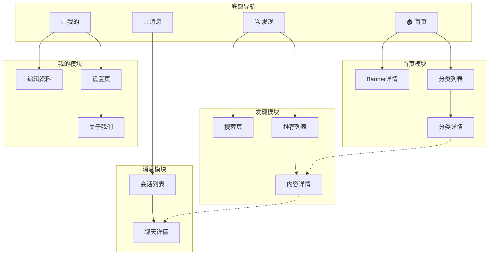

# Phase 2: Information Architecture （信息架构设计）

## Objective

Map out the complete page structure of the product. This is the equivalent of Modao's "page tree" feature.

## Deliverables

1. Page inventory table
2. Sitemap (Mermaid diagram)
3. Navigation structure
4. Global component list

---

## 1. Page Inventory Table

List every page/screen in the product. Use this table format:

```markdown
| 编号 | 页面名称 | 所属模块 | 层级 | 页面类型 | 入口来源 | 简要说明 |
|------|---------|---------|------|---------|---------|---------|
| P01 | 首页 | 核心 | L1 | 聚合页 | App启动/底部Tab | 首页信息流和快捷入口 |
| P02 | 搜索页 | 搜索 | L2 | 搜索页 | 首页搜索栏 | 搜索输入+结果展示 |
| P03 | 详情页 | 内容 | L3 | 详情页 | 列表项点击 | 内容详情和操作区 |
```

### Page Type Reference

**核心内容类 (1-5)**

| 编号 | 类型 | 英文 | 典型特征 | 示例 |
|------|------|------|---------|------|
| 1 | 聚合页 | Hub | 多模块入口集合 | 首页、工作台 |
| 2 | 列表页 | List | 同类内容的集合展示 | 消息列表、订单列表 |
| 3 | 详情页 | Detail | 单条内容的完整展示 | 商品详情、用户资料 |
| 4 | 搜索页 | Search | 搜索输入+结果 | 全局搜索 |
| 5 | 筛选/排序页 | Filter | 条件组合缩小结果范围 | 商品筛选、高级搜索 |

**表单与输入类 (6-8)**

| 编号 | 类型 | 英文 | 典型特征 | 示例 |
|------|------|------|---------|------|
| 6 | 表单页 | Form | 用户输入/编辑信息 | 注册、编辑资料、发布 |
| 7 | 多步表单 | Wizard | 分步骤引导完成复杂输入 | 开户流程、发布向导 |
| 8 | 选择器页 | Picker | 从预设选项中选择 | 城市选择、标签选择 |

**反馈与结果类 (9-10)**

| 编号 | 类型 | 英文 | 典型特征 | 示例 |
|------|------|------|---------|------|
| 9 | 结果页 | Result | 操作结果反馈 | 支付成功、提交成功 |
| 10 | 空态页 | Empty | 无内容时的占位 | （通常作为状态而非独立页面） |

**账户与系统类 (11-14)**

| 编号 | 类型 | 英文 | 典型特征 | 示例 |
|------|------|------|---------|------|
| 11 | 登录/注册页 | Auth | 身份验证入口 | 登录、注册、忘记密码 |
| 12 | 个人中心 | Profile | 用户个人信息和功能入口 | 我的页面、账户中心 |
| 13 | 设置页 | Settings | 配置项列表 | 系统设置、账户设置 |
| 14 | 关于/协议页 | About | 产品信息和法律文本 | 关于我们、用户协议、隐私政策 |

**引导与过渡类 (15-17)**

| 编号 | 类型 | 英文 | 典型特征 | 示例 |
|------|------|------|---------|------|
| 15 | 启动页 | Splash | App 启动时的品牌展示 | 开屏页、启动画面 |
| 16 | 引导页 | Onboarding | 首次使用的功能介绍 | 新手引导、功能介绍轮播 |
| 17 | 过渡/加载页 | Transition | 等待过程中的反馈 | 加载中、处理中 |

**覆盖层类 (18)**

| 编号 | 类型 | 英文 | 典型特征 | 示例 |
|------|------|------|---------|------|
| 18 | 弹窗/浮层 | Overlay | 覆盖在页面之上的临时层 | 确认弹窗、底部面板、气泡菜单 |

**桌面端专属类 (19-22)**

| 编号 | 类型 | 英文 | 典型特征 | 示例 |
|------|------|------|---------|------|
| 19 | 主窗口/工作区 | Workspace | 桌面端核心操作区域 | 编辑器主界面、IDE 工作区 |
| 20 | 侧边面板 | Side Panel | 可展开/折叠的辅助面板 | 文件树、属性面板 |
| 21 | 偏好设置窗口 | Preferences | 桌面端独立设置窗口 | 应用偏好设置 |
| 22 | 托盘/菜单栏 | Tray/Menu Bar | 系统托盘或菜单栏入口 | 状态图标、快捷菜单 |

### Level Convention

- **L1**: Tab 直达页（底部导航直接展示）
- **L2**: 一级子页（从 L1 页面进入）
- **L3**: 二级子页（从 L2 页面进入）
- **L4**: 三级子页（尽量避免，超过 4 层说明架构需要优化）

### 页面穷举校验

设计页面清单后，按以下维度逐一校验是否有遗漏页面：

| 校验维度 | 检查项 |
|---------|-------|
| 用户生命周期 | 注册、登录、新手引导、日常使用、账号注销/休眠 |
| 内容生命周期 | 创建、编辑、审核、发布、归档、删除 |
| 交易生命周期 | 浏览、下单、支付、履约、售后、评价 |
| 账户管理 | 个人资料、安全设置、绑定管理、实名认证 |
| 消息通知 | 通知列表、通知详情、通知设置、推送落地页 |
| 异常兜底 | 404页面、网络错误、服务维护、降级页面 |
| 法规合规 | 用户协议、隐私政策、Cookie 同意、数据导出 |
| 桌面端专属 | 安装向导、窗口管理、托盘菜单、自动更新提示、快捷键设置、系统集成（文件关联/协议处理） |

---

## 2. Sitemap (Mermaid)

Use `graph TD` to show the page hierarchy. Color-code by module.



Tips for Mermaid sitemaps:
- Use `subgraph` to group by module
- Use solid arrows `-->` for primary navigation
- Use dashed arrows `-.->` for cross-module jumps
- Add emoji icons for Tab items to aid visualization
- Keep it under 40 nodes — split into sub-diagrams if larger

---

## 3. Navigation Structure

### Tab Bar / Bottom Navigation

```markdown
## 底部导航设计

| Tab | 名称 | 图标 | 默认页面 | 角标策略 |
|-----|------|------|---------|---------|
| Tab 1 | 首页 | home (outline/filled) | 首页信息流 | 无 |
| Tab 2 | 发现 | compass | 发现列表 | 新内容时显示红点 |
| Tab 3 | 消息 | message-circle | 会话列表 | 显示未读数（99+封顶） |
| Tab 4 | 我的 | user | 个人中心 | 有待办事项时显示红点 |

### 导航栏行为
- 滚动时：<<固定/隐藏/变色/缩小>>
- 返回按钮：<<显示条件和行为>>
- 标题：<<居中/居左，是否支持大标题模式>>
- 右侧操作：<<常见操作按钮>>
```

### Desktop Navigation Patterns

```markdown
## 桌面端导航设计

### 侧边栏导航（可折叠）
- 展开宽度：<<200-280px>>
- 折叠宽度：<<48-64px，仅显示图标>>
- 折叠触发：<<手动按钮/窗口宽度阈值>>
- 层级：<<支持嵌套分组/树形结构>>

### 顶部菜单栏
- 菜单项：<<文件/编辑/视图/帮助等>>
- 快捷键显示：<<菜单项右侧显示快捷键>>

### 混合导航
- 顶部：<<菜单栏 + 工具栏>>
- 侧边：<<模块导航 + 树形结构>>
- 底部：<<状态栏>>

### 键盘快捷键绑定
- 全局快捷键：<<Cmd/Ctrl+K 命令面板, Cmd/Ctrl+, 设置>>
- 模块快捷键：<<按功能模块分组>>
- 快捷键冲突检测：<<与系统快捷键不冲突>>
```

### Navigation Type Decision

| 产品类型 | 推荐导航 | 理由 |
|---------|---------|------|
| C端 App (< 5模块) | 底部 Tab | 拇指区易触达，符合移动端习惯 |
| C端 App (≥ 5模块) | 底部 Tab + 更多页 | 避免 Tab 过多 |
| B端 Web | 侧边栏 | 信息密度高，层级深 |
| 工具型 App | 顶部 Tab + 底部操作栏 | 内容区域最大化 |
| 内容型 App | 底部 Tab + 顶部分段 | 内容为主，分类辅助 |
| PC客户端 | 侧边栏（可折叠）+ 顶部菜单栏 | 大屏信息密度高，支持键盘操作 |
| 跨平台 | 响应式导航（移动端底部Tab↔桌面端侧边栏） | 适配不同屏幕尺寸 |

---

## 4. Global Components

List components shared across multiple pages:

```markdown
## 全局组件清单

### 导航类
- **顶部导航栏**：标准样式（返回+标题+操作）/ 透明样式（沉浸式）/ 搜索样式
- **底部 Tab 栏**：固定底部，切换时无动画 / 有动画

### 反馈类
- **Toast 提示**：成功（绿色✓）/ 失败（红色✗）/ 加载中（转圈）/ 纯文本
- **确认弹窗**：标题+内容+双按钮 / 标题+内容+单按钮
- **底部操作面板 (Action Sheet)**：操作列表 + 取消
- **加载状态**：全页骨架屏 / 列表骨架屏 / 内容加载转圈

### 空态类
- **无数据空态**：插图 + 文案 + 可选操作按钮
- **网络错误**：插图 + 文案 + 重试按钮
- **无权限**：插图 + 文案 + 引导按钮

### 桌面端专属类
- **侧边栏 (Sidebar)**：可折叠导航面板，支持树形结构和拖拽排序
- **工具栏 (Toolbar)**：上下文相关的操作按钮栏，支持自定义布局
- **右键菜单 (Context Menu)**：上下文操作菜单，支持嵌套子菜单和快捷键提示
- **命令面板 (Command Palette)**：Cmd/Ctrl+K 快捷搜索命令和页面
- **状态栏 (Status Bar)**：底部信息栏，显示状态、进度、通知

### 业务类
（根据具体产品补充，如：用户头像卡片、内容卡片、操作工具栏等）
```

---

## Quality Checklist

Before moving to Phase 3:
- [ ] All pages accounted for (no orphan pages)
- [ ] Page hierarchy ≤ 4 levels
- [ ] Core features reachable in ≤ 3 taps from home
- [ ] Navigation pattern matches product type and platform conventions
- [ ] Cross-module navigation paths identified
- [ ] Global components are consistent and reusable
- [ ] Mermaid sitemap renders correctly

