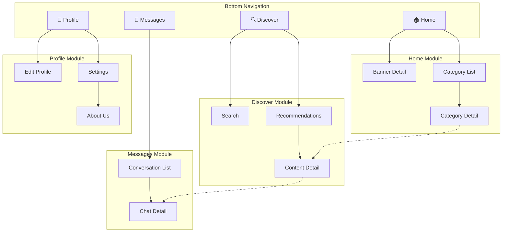

# Phase 2: Information Architecture

## Objective

Map out the complete page structure of the product. This is the equivalent of Modao's "page tree" feature.

## Deliverables

1. Page inventory table
2. Sitemap (Mermaid diagram)
3. Navigation structure
4. Global component list

---

## 1. Page Inventory Table

List every page/screen in the product. Use this table format:

```markdown
| ID | Page Name | Module | Level | Page Type | Entry Source | Description |
|----|-----------|--------|-------|-----------|--------------|-------------|
| P01 | Home | Core | L1 | Hub | App launch / Bottom Tab | Home feed and quick entries |
| P02 | Search | Search | L2 | Search | Home search bar | Search input + results |
| P03 | Detail | Content | L3 | Detail | List item tap | Content detail and actions |
```

### Page Type Reference

**Core Content Types (1-5)**

| ID | Type | Characteristics | Examples |
|----|------|-----------------|----------|
| 1 | Hub | Multi-module entry collection | Home, Dashboard |
| 2 | List | Collection display of similar content | Message list, Order list |
| 3 | Detail | Complete display of single content | Product detail, User profile |
| 4 | Search | Search input + results | Global search |
| 5 | Filter | Condition combination to narrow results | Product filter, Advanced search |

**Form & Input Types (6-8)**

| ID | Type | Characteristics | Examples |
|----|------|-----------------|----------|
| 6 | Form | User input/edit information | Registration, Edit profile, Publish |
| 7 | Wizard | Step-by-step guidance for complex input | Account opening flow, Publish wizard |
| 8 | Picker | Select from preset options | City picker, Tag selection |

**Feedback & Result Types (9-10)**

| ID | Type | Characteristics | Examples |
|----|------|-----------------|----------|
| 9 | Result | Operation result feedback | Payment success, Submit success |
| 10 | Empty | Placeholder when no content | (Usually a state, not a standalone page) |

**Account & System Types (11-14)**

| ID | Type | Characteristics | Examples |
|----|------|-----------------|----------|
| 11 | Auth | Authentication entry | Login, Register, Forgot password |
| 12 | Profile | User personal info and feature entries | My page, Account center |
| 13 | Settings | Configuration item list | System settings, Account settings |
| 14 | About | Product info and legal text | About us, User agreement, Privacy policy |

**Onboarding & Transition Types (15-17)**

| ID | Type | Characteristics | Examples |
|----|------|-----------------|----------|
| 15 | Splash | Brand display at app launch | Launch screen, Splash page |
| 16 | Onboarding | Feature intro for first-time users | New user guide, Feature carousel |
| 17 | Transition | Feedback during waiting | Loading, Processing |

**Overlay Types (18)**

| ID | Type | Characteristics | Examples |
|----|------|-----------------|----------|
| 18 | Overlay | Temporary layer above page | Confirm dialog, Bottom sheet, Popover menu |

**Desktop-Exclusive Types (19-22)**

| ID | Type | Characteristics | Examples |
|----|------|-----------------|----------|
| 19 | Workspace | Desktop core operation area | Editor main interface, IDE workspace |
| 20 | Side Panel | Expandable/collapsible auxiliary panel | File tree, Properties panel |
| 21 | Preferences | Desktop standalone settings window | App preferences |
| 22 | Tray/Menu Bar | System tray or menu bar entry | Status icon, Quick menu |

### Level Convention

- **L1**: Tab-direct pages (shown in bottom navigation)
- **L2**: First-level subpages (entered from L1)
- **L3**: Second-level subpages (entered from L2)
- **L4**: Third-level subpages (avoid if possible; >4 levels indicates architecture needs optimization)

### Page Exhaustiveness Check

After designing the page inventory, verify against these dimensions for missing pages:

| Check Dimension | Items |
|-----------------|-------|
| User Lifecycle | Registration, Login, Onboarding, Daily use, Account deletion/dormancy |
| Content Lifecycle | Create, Edit, Review, Publish, Archive, Delete |
| Transaction Lifecycle | Browse, Order, Pay, Fulfill, After-sales, Review |
| Account Management | Profile, Security settings, Binding management, Verification |
| Notifications | Notification list, Notification detail, Notification settings, Push landing page |
| Exception Handling | 404 page, Network error, Maintenance, Degraded page |
| Compliance | User agreement, Privacy policy, Cookie consent, Data export |
| Desktop-Exclusive | Install wizard, Window management, Tray menu, Auto-update prompt, Shortcut settings, System integration (file association / protocol handling) |

---

## 2. Sitemap (Mermaid)

Use `graph TD` to show the page hierarchy. Color-code by module.



Tips for Mermaid sitemaps:
- Use `subgraph` to group by module
- Use solid arrows `-->` for primary navigation
- Use dashed arrows `-.->` for cross-module jumps
- Add emoji icons for Tab items to aid visualization
- Keep it under 40 nodes — split into sub-diagrams if larger

---

## 3. Navigation Structure

### Tab Bar / Bottom Navigation

```markdown
## Bottom Navigation Design

| Tab | Name | Icon | Default Page | Badge Strategy |
|-----|------|------|--------------|----------------|
| Tab 1 | Home | home (outline/filled) | Home feed | None |
| Tab 2 | Discover | compass | Discover list | Show dot for new content |
| Tab 3 | Messages | message-circle | Conversation list | Show unread count (max 99+) |
| Tab 4 | Profile | user | Personal center | Show dot for pending items |

### Navigation Bar Behavior
- On scroll: <<fixed/hidden/color change/shrink>>
- Back button: <<display conditions and behavior>>
- Title: <<center/left-aligned, support large title mode?>>
- Right actions: <<common action buttons>>
```

### Desktop Navigation Patterns

```markdown
## Desktop Navigation Design

### Sidebar Navigation (Collapsible)
- Expanded width: <<200-280px>>
- Collapsed width: <<48-64px, icons only>>
- Collapse trigger: <<manual button / window width threshold>>
- Hierarchy: <<support nested groups / tree structure>>

### Top Menu Bar
- Menu items: <<File/Edit/View/Help, etc.>>
- Shortcut display: <<show shortcuts on menu item right>>

### Hybrid Navigation
- Top: <<menu bar + toolbar>>
- Side: <<module navigation + tree structure>>
- Bottom: <<status bar>>

### Keyboard Shortcut Bindings
- Global shortcuts: <<Cmd/Ctrl+K command palette, Cmd/Ctrl+, settings>>
- Module shortcuts: <<grouped by feature module>>
- Shortcut conflict detection: <<no conflicts with system shortcuts>>
```

### Navigation Type Decision

| Product Type | Recommended Navigation | Reason |
|--------------|----------------------|--------|
| Consumer App (< 5 modules) | Bottom Tab | Thumb-friendly, matches mobile conventions |
| Consumer App (≥ 5 modules) | Bottom Tab + More page | Avoid too many tabs |
| Enterprise Web | Sidebar | High information density, deep hierarchy |
| Tool App | Top Tab + Bottom action bar | Maximize content area |
| Content App | Bottom Tab + Top segment | Content-first, category-secondary |
| PC Client | Sidebar (collapsible) + Top menu bar | Large screen high density, keyboard support |
| Cross-platform | Responsive navigation (mobile bottom tab ↔ desktop sidebar) | Adapt to different screen sizes |

---

## 4. Global Components

List components shared across multiple pages:

```markdown
## Global Component Inventory

### Navigation
- **Top Navigation Bar**: Standard style (back + title + action) / Transparent style (immersive) / Search style
- **Bottom Tab Bar**: Fixed bottom, switch with/without animation

### Feedback
- **Toast**: Success (green ✓) / Failure (red ✗) / Loading (spinner) / Text only
- **Confirm Dialog**: Title + content + two buttons / Title + content + single button
- **Action Sheet**: Action list + cancel
- **Loading State**: Full-page skeleton / List skeleton / Content loading spinner

### Empty States
- **No Data**: Illustration + text + optional action button
- **Network Error**: Illustration + text + retry button
- **No Permission**: Illustration + text + guide button

### Desktop-Exclusive
- **Sidebar**: Collapsible navigation panel, supports tree structure and drag reorder
- **Toolbar**: Context-aware action button bar, supports custom layout
- **Context Menu**: Right-click menu, supports nested submenus and shortcut hints
- **Command Palette**: Cmd/Ctrl+K quick search for commands and pages
- **Status Bar**: Bottom info bar, shows status, progress, notifications

### Business-Specific
(Add based on specific product, e.g., user avatar card, content card, action toolbar, etc.)
```

---

## Quality Checklist

Before moving to Phase 3:
- [ ] All pages accounted for (no orphan pages)
- [ ] Page hierarchy ≤ 4 levels
- [ ] Core features reachable in ≤ 3 taps from home
- [ ] Navigation pattern matches product type and platform conventions
- [ ] Cross-module navigation paths identified
- [ ] Global components are consistent and reusable
- [ ] Mermaid sitemap renders correctly