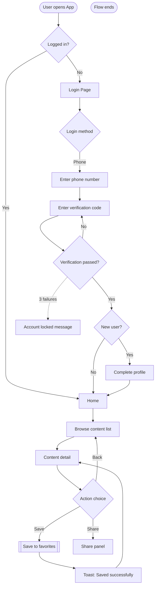

# Phase 3: User Flows

## Objective

Design task-oriented flow diagrams for 3-5 core user scenarios. This is the equivalent of Modao's "flow connector" feature.

## How to Identify Core Tasks

Ask the user or derive from the feature list. Good core tasks are:
- **High frequency**: Tasks users perform most often
- **High value**: Tasks that directly deliver the product's value proposition
- **High complexity**: Tasks with multiple steps or decision points
- **Onboarding**: First-time user experience

Example task patterns:
- New user: Register → Onboard → Complete first core action
- Returning user: Search → Browse → Take action → See result
- Transaction: Select → Configure → Confirm → Pay → Track
- Desktop cold start: Download → Install wizard → First launch → Config wizard → Main workspace
- Desktop auto-update: Check update → Prompt user → Background download → Install → Restart

---

## Deliverable 1: Mermaid Flowchart

For each core task, produce a `flowchart TD` diagram.

### Flowchart Conventions

```
Node shapes:
  ([  ]) = Start / End (stadium shape)
  [  ]   = Page / Screen
  {  }   = Decision point
  [[  ]] = System process (backend)
  >  ]   = Async event / notification

Arrow types:
  -->    = Normal flow (solid)
  -.->   = Error / alternative path (dashed)
  ==>    = Highlighted / critical path (thick)

Labels:
  -->|label| = Condition on the arrow
```

### Example Flowchart



### Flowchart Patterns to Cover

For each task, the flowchart must show:

1. **Happy path** (solid arrows): The ideal flow when everything works
2. **Error paths** (dashed arrows): Network failure, validation error, permission denied
3. **Decision branches**: Login state, user role, data conditions
4. **Loading states**: Where the system needs time to respond (mark with `[[process]]`)
5. **Exit points**: Where users might abandon the flow

---

## Deliverable 2: Step Table

For each flowchart, provide a detailed step table:

[English]
```markdown
| Step | Page/Component | User Action | System Response | Exception Handling | Time Estimate |
|------|----------------|-------------|-----------------|-------------------|---------------|
| 1 | App Launch | Tap app icon | Show splash → Check login state | - | < 2s |
| 2 | Login Page | Enter phone number | Real-time format validation | Format error: red hint | - |
| 3 | Login Page | Tap get code | Send SMS + 60s countdown | Network fail: Toast, retry | < 1s |
| 4 | Login Page | Enter code | Auto-submit verification | Code error: clear + hint | < 2s |
| 5 | Home | - | Load home data (skeleton) | Load fail: error state + retry | < 3s |
```

[中文]
```markdown
| 步骤 | 页面/组件 | 用户操作 | 系统响应 | 异常处理 | 耗时预估 |
|------|----------|---------|---------|---------|---------|
| 1 | App启动 | 点击App图标 | 显示启动页→检查登录态 | - | < 2s |
| 2 | 登录页 | 输入手机号 | 实时格式校验 | 格式错误：红色提示 | - |
| 3 | 登录页 | 点击获取验证码 | 发送短信+60s倒计时 | 网络失败：Toast提示，可重试 | < 1s |
| 4 | 登录页 | 输入验证码 | 自动提交验证 | 验证码错误：清空+提示 | < 2s |
| 5 | 首页 | - | 加载首页数据（骨架屏） | 加载失败：错误态+重试 | < 3s |
```


### Time Estimate Guidelines

| Operation Type | User Expectation | Timeout Handling |
|----------------|------------------|------------------|
| Page transition | < 300ms | No loading needed |
| Local data load | < 1s | Skeleton screen |
| Network request | < 3s | Skeleton + loading indicator |
| Complex calc/upload | < 10s | Progress bar |
| Background process | > 10s | Polling / Push notification |

---

## Deliverable 3: Key Decision Points

For each decision node in the flowchart, document the business logic:

[English]
```markdown
## Key Decision Points

### Decision Point 1: Login State Check
- **Condition**: Check if local token exists and is not expired
- **Yes**: Go directly to home
- **No**: Redirect to login page
- **Edge case**: Token expired but refresh token exists → Silent refresh

### Decision Point 2: New/Returning User Check
- **Condition**: Server returns is_new_user field
- **New user**: Enter onboarding flow (complete profile → tutorial)
- **Returning user**: Go directly to home
- **Edge case**: Returning user on new device → Not counted as new user
```

[中文]
```markdown
## 关键决策点

### 决策点 1：登录态判断
- **判断条件**：检查本地 token 是否存在且未过期
- **是**：直接进入首页
- **否**：跳转登录页
- **边界情况**：token 过期但有 refresh token → 静默刷新

### 决策点 2：新老用户判断
- **判断条件**：服务端返回 is_new_user 字段
- **新用户**：进入引导流程（完善资料→新手教程）
- **老用户**：直接进入首页
- **边界情况**：老用户首次登录新设备 → 不算新用户
```

---

## Common Flow Templates

### Registration / Onboarding
```
Start → Login method selection → Credential input → Verification →
  → New user? → Yes: Profile setup → Tutorial → Home
              → No: Home
```

### Search & Browse
```
Start → Search input → Search results → Filter/sort →
  → Item detail → Action (save/share/purchase) → Result feedback
```

### Transaction / Purchase
```
Start → Item selection → Cart/configuration → Confirm order →
  → Payment method → Payment processing → Success/Failure →
  → Order tracking
```

### Content Creation / Publishing
```
Start → Create/Edit → Preview → Submit →
  → Review status → Published / Revision needed
```

### Desktop Installation & Update
```
Start → Download installer → Run installer → Installation options →
  → Installing (progress) → First launch → Config wizard → Main workspace

Update: Check for updates → Update available prompt →
  → User accepts → Background download → Ready to install →
  → Restart & apply → Updated workspace
```

---

## Quality Checklist

### Basic Verification

Before moving to Phase 4:
- [ ] 3-5 core tasks covered with flowcharts
- [ ] Happy path is clearly marked for each flow
- [ ] At least 2 error/exception paths per flow
- [ ] Every decision node has documented business logic
- [ ] Step table includes time estimates
- [ ] No dead-end nodes (every path reaches an end or loops back)
- [ ] Mermaid flowcharts render correctly

### Output Verification Procedure

After completing Phase 3, perform the following verification:

1. **Read Output File**: `doc/ixd/phase3-userflows.md`

2. **Check Document Structure**:
   - [ ] All required sections present (Core Flows, Exception Flows, Flow Diagrams)
   - [ ] Mermaid flowcharts render correctly
   - [ ] Step tables are complete

3. **Verify Completeness**:
   - [ ] 3-5 core user flows documented
   - [ ] Each flow has happy path + 2+ exception paths
   - [ ] Decision nodes have business logic documented
   - [ ] Time estimates included in step tables

4. **Verify Quality**:
   - [ ] No dead-end nodes in any flow
   - [ ] Flows can be traced start-to-end
   - [ ] Cross-references to Phase 2 pages are valid

5. **Output Summary**:
   ```markdown
   ## Phase 3 Output Verification Report

   **Date**: YYYY-MM-DD
   **Status**: ✅ PASS / ❌ FAIL

   ### Structure Check
   - Sections: X complete
   - Flowcharts: X render correctly

   ### Completeness Check
   - Core Flows: X (target: 3-5)
   - Exception Paths: X total
   - Decision Nodes: X documented

   ### Quality Check
   - Dead-end Nodes: X found
   - Traceability: ✅ Complete / ❌ Incomplete

   ### Issues Found
   - <<Issue 1>>
   - <<Issue 2>>

   ### Verdict
   ✅ Ready for Phase 4
   ❌ Needs revision
   ```

6. **Update Progress**:
   - If PASS: Mark Phase 3 as complete in `progress.json`
   - If FAIL: Fix issues, re-run verification