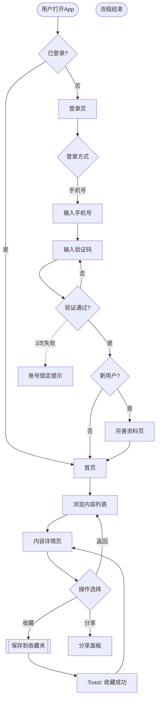

# Phase 3: User Flows （核心用户流程）

## Objective

Design task-oriented flow diagrams for 3-5 core user scenarios. This is the equivalent of Modao's "flow connector" feature.

## How to Identify Core Tasks

Ask the user or derive from the feature list. Good core tasks are:
- **High frequency**: Tasks users perform most often
- **High value**: Tasks that directly deliver the product's value proposition
- **High complexity**: Tasks with multiple steps or decision points
- **Onboarding**: First-time user experience

Example task patterns:
- New user: Register → Onboard → Complete first core action
- Returning user: Search → Browse → Take action → See result
- Transaction: Select → Configure → Confirm → Pay → Track
- Desktop cold start: Download → Install wizard → First launch → Config wizard → Main workspace
- Desktop auto-update: Check update → Prompt user → Background download → Install → Restart

---

## Deliverable 1: Mermaid Flowchart

For each core task, produce a `flowchart TD` diagram.

### Flowchart Conventions

```
Node shapes:
  ([  ]) = Start / End (stadium shape)
  [  ]   = Page / Screen
  {  }   = Decision point
  [[  ]] = System process (backend)
  >  ]   = Async event / notification

Arrow types:
  -->    = Normal flow (solid)
  -.->   = Error / alternative path (dashed)
  ==>    = Highlighted / critical path (thick)

Labels:
  -->|label| = Condition on the arrow
```

### Example Flowchart



### Flowchart Patterns to Cover

For each task, the flowchart must show:

1. **Happy path** (solid arrows): The ideal flow when everything works
2. **Error paths** (dashed arrows): Network failure, validation error, permission denied
3. **Decision branches**: Login state, user role, data conditions
4. **Loading states**: Where the system needs time to respond (mark with `[[process]]`)
5. **Exit points**: Where users might abandon the flow

---

## Deliverable 2: Step Table

For each flowchart, provide a detailed step table:

```markdown
| 步骤 | 页面/组件 | 用户操作 | 系统响应 | 异常处理 | 耗时预估 |
|------|----------|---------|---------|---------|---------|
| 1 | App启动 | 点击App图标 | 显示启动页→检查登录态 | - | < 2s |
| 2 | 登录页 | 输入手机号 | 实时格式校验 | 格式错误：红色提示 | - |
| 3 | 登录页 | 点击获取验证码 | 发送短信+60s倒计时 | 网络失败：Toast提示，可重试 | < 1s |
| 4 | 登录页 | 输入验证码 | 自动提交验证 | 验证码错误：清空+提示 | < 2s |
| 5 | 首页 | - | 加载首页数据（骨架屏） | 加载失败：错误态+重试 | < 3s |
```

### Time Estimate Guidelines

| 操作类型 | 用户预期 | 超时处理 |
|---------|---------|---------|
| 页面跳转 | < 300ms | 不需要 loading |
| 本地数据加载 | < 1s | 骨架屏 |
| 网络请求 | < 3s | 骨架屏 + loading 指示器 |
| 复杂计算/上传 | < 10s | 进度条 |
| 后台处理 | > 10s | 轮询/推送通知 |

---

## Deliverable 3: Key Decision Points

For each decision node in the flowchart, document the business logic:

```markdown
## 关键决策点

### 决策点 1：登录态判断
- **判断条件**：检查本地 token 是否存在且未过期
- **是**：直接进入首页
- **否**：跳转登录页
- **边界情况**：token 过期但有 refresh token → 静默刷新

### 决策点 2：新老用户判断
- **判断条件**：服务端返回 is_new_user 字段
- **新用户**：进入引导流程（完善资料→新手教程）
- **老用户**：直接进入首页
- **边界情况**：老用户首次登录新设备 → 不算新用户
```

---

## Common Flow Templates

### Registration / Onboarding
```
Start → Login method selection → Credential input → Verification →
  → New user? → Yes: Profile setup → Tutorial → Home
              → No: Home
```

### Search & Browse
```
Start → Search input → Search results → Filter/sort →
  → Item detail → Action (save/share/purchase) → Result feedback
```

### Transaction / Purchase
```
Start → Item selection → Cart/configuration → Confirm order →
  → Payment method → Payment processing → Success/Failure →
  → Order tracking
```

### Content Creation / Publishing
```
Start → Create/Edit → Preview → Submit →
  → Review status → Published / Revision needed
```

### Desktop Installation & Update
```
Start → Download installer → Run installer → Installation options →
  → Installing (progress) → First launch → Config wizard → Main workspace
  
Update: Check for updates → Update available prompt → 
  → User accepts → Background download → Ready to install →
  → Restart & apply → Updated workspace
```

---

## Quality Checklist

Before moving to Phase 4:
- [ ] 3-5 core tasks covered with flowcharts
- [ ] Happy path is clearly marked for each flow
- [ ] At least 2 error/exception paths per flow
- [ ] Every decision node has documented business logic
- [ ] Step table includes time estimates
- [ ] No dead-end nodes (every path reaches an end or loops back)
- [ ] Mermaid flowcharts render correctly


